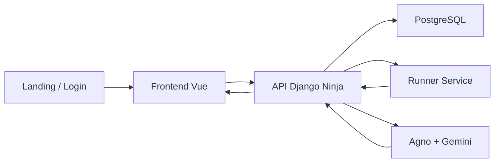

# Visão Arquitetural

## Leitura rápida

O sistema atual é pequeno, mas já tem separação funcional suficiente para evoluir sem colapsar tudo num único processo:

- `frontend/`: superfície pública e arena autenticada;
- `backend/`: API principal, persistência e orquestração;
- `runner_service/`: execução isolada de código;
- `PostgreSQL`: persistência de usuários, exercícios, casos de teste e submissões;
- `Gemini via Agno`: geração de feedback e conversa contextual.

## Fluxo ponta a ponta

## Fronteiras principais

### 1. Frontend

Responsável por:

- controlar sessão;
- carregar catálogo e detalhes dos exercícios;
- capturar o código digitado;
- submeter solução;
- exibir console, feedback, chat e histórico;
- manter parte da gamificação local.

### 2. Backend principal

Responsável por:

- autenticar o usuário;
- persistir o estado durável do sistema;
- modelar exercícios e submissões;
- chamar o runner;
- normalizar correção;
- disparar e persistir revisão com IA.

### 3. Runner

Responsável por:

- executar código Python isoladamente;
- devolver `stdout`, `stderr` e status de execução;
- não carregar responsabilidade de domínio pedagógico.

### 4. IA

Responsável por:

- traduzir resultados de teste em feedback;
- explicar acertos e erros;
- continuar uma conversa contextual sobre uma submissão específica.

## Por que a arquitetura atual faz sentido

Mesmo sendo um MVP, separar backend principal e runner já traz três vantagens:

- impede que a execução arbitrária fique dentro do processo principal da API;
- deixa a avaliação mais observável;
- prepara o terreno para limites de execução, hardening e futuras linguagens.

## Estado atual da arquitetura

Desde abril de 2026, a base principal já foi reorganizada:

- `backend/apps/*` concentra os bounded contexts reais do monólito;
- `frontend/src` segue `Feature-Sliced Design` como estrutura canônica;
- `backend/apps/arena` ficou como shell de integração da API pública;
- `practice` e `progress` já ganharam `domain/` para regras comportamentais mais densas.

## O que ainda está evoluindo

- o shell `backend/apps/arena` ainda precisa continuar emagrecendo ao longo das próximas rodadas;
- os guardrails arquiteturais ainda devem ficar mais rígidos com o tempo;
- o ranking ainda não existe;
- novos formatos de exercício ainda dependem da evolução do domínio de prática e revisão.

## Leituras seguintes

- [[Decisões Arquiteturais]]
- [[../02_Bounded_Contexts/Submissão, Runner e Correção]]
- [[../02_Bounded_Contexts/Revisão com IA]]
